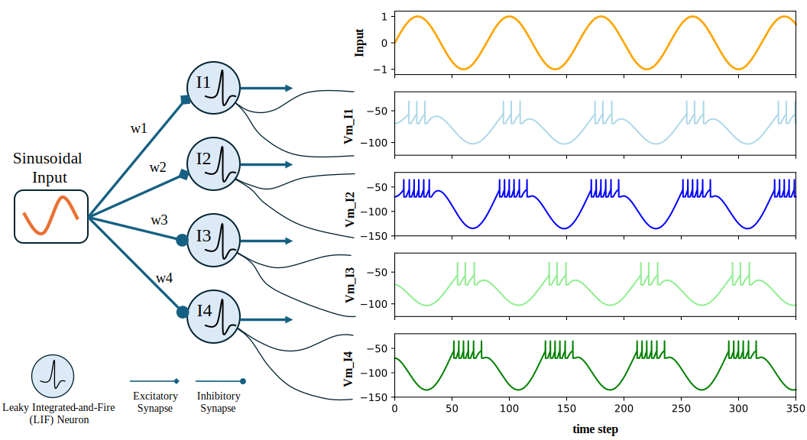

# SIPP__Spiking-Input-Preprocessing
A Spiking Input Preprocessing (SIPP) system is designed to transform traditional analog or continuous signals into spike-based (event-driven) representations for subsequent processing in spiking neural networks (SNNs) and neuromorphic computing systems.
This system can be implemented by directly feeding analog or continuous signals into a spiking neuron model (e.g., Leaky Integrate-and-Fire (LIF)). With appropriately configured synaptic weights—either manually set or learned—the neuron generates spike-based outputs. 

## Example: Sinusoidal Input Processing
An example of a spiking input preprocessing system for processing a sinusoidal input signal using four Leaky Integrate-and-Fire (LIF) neurons, with parameters derived from the NEST Simulator [1], is shown in the figure below. The sinusoidal input is fed into the LIF neurons (I1–I4) through synaptic connections, each with a different weight. 
In this case, the synaptic weights are set as follows: w1 = 1000, w2 = 2000, w3= -1000, and w4= -2000.

  

  <em>Fig. 1. Spiking Input Preprocessing (SIPP) system using LIF neurons.</em>

## Reference
[1] NEST Simulator Documentation. [Online]. Available: https://nest-simulator.readthedocs.io/en/stable/
